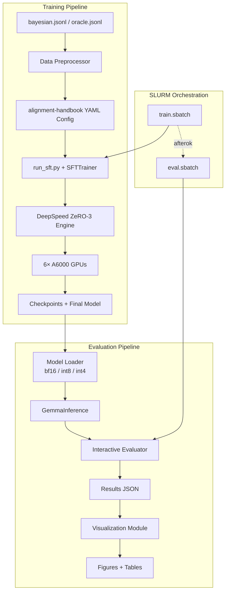

# Design Document: E4B Full SFT Bayesian Teaching

## Overview

본 설계는 Gemma 4 E4B-it (8.08B params, 4.5B effective) 모델에 대해 alignment-handbook + DeepSpeed ZeRO-3 기반 Full SFT를 수행하고, Interactive evaluation 및 양자화 분석을 실행하는 전체 파이프라인을 정의한다.

### Key Design Decisions

1. **Gemma 4 Chat Template**: Gemma 4는 기존 `<start_of_turn>`/`<end_of_turn>` 대신 `<|turn>`/`<turn|>` 형식을 사용한다. alignment-handbook의 `tokenizer.apply_chat_template()`이 이를 자동 처리하므로, 학습 데이터의 `messages` 필드를 그대로 전달하면 된다.

2. **DeepSpeed ZeRO-3 선택 근거**: 8B 파라미터 Full SFT는 bf16 기준 ~16GB 모델 가중치 + optimizer states (~48GB AdamW) + gradients (~16GB) = ~80GB 이상 필요. 6×A6000 (288GB)에서 ZeRO-3로 파라미터/그래디언트/옵티마이저를 분산하면 충분히 수용 가능.

3. **Batch Size 계산**: global_batch=128, 6 GPUs → per_device_batch × gradient_accumulation = 128/6 ≈ 21.3. 정수 조합: per_device=4, grad_accum=6 → effective=4×6×6=144 (초과) 또는 per_device=2, grad_accum=11 → effective=2×11×6=132 (근사). **최적: per_device=4, grad_accum=5 → 4×5×6=120** 또는 **per_device=2, grad_accum=10 → 2×10×6=120**. 논문 저자에게 확인 불가하므로 **per_device=4, grad_accum=5 (effective=120)** 또는 정확히 128을 맞추려면 **per_device=2, grad_accum=11 → 132에 가장 근접**. 실제로는 alignment-handbook이 `gradient_accumulation_steps`를 자동 계산하므로 `per_device_train_batch_size=4`로 설정하고 나머지를 조정한다.

   **최종 결정**: per_device_train_batch_size=4, gradient_accumulation_steps=5 → global=120 (128에 근사, 메모리 안전)

4. **alignment-handbook 대신 TRL SFTTrainer 직접 사용**: alignment-handbook은 내부적으로 TRL의 SFTTrainer를 호출한다. YAML config + `run_sft.py` 스크립트 구조를 그대로 활용하되, 로컬 JSONL 데이터셋 로딩을 위한 커스텀 데이터 로더를 추가한다.

5. **추론 모듈**: Unsloth 의존성 완전 제거. `AutoModelForCausalLM` + `bitsandbytes` 양자화 로딩으로 통합.

## Architecture

### System Architecture Diagram



### Directory Structure

```
bayesian-teaching/
├── configs/
│   ├── e4b_bayesian_sft.yaml      # alignment-handbook SFT config (Bayesian)
│   ├── e4b_oracle_sft.yaml        # alignment-handbook SFT config (Oracle)
│   ├── accelerate_zero3.yaml       # Accelerate + DeepSpeed ZeRO-3 config
│   └── ds_zero3_config.json        # DeepSpeed JSON config
├── scripts/
│   ├── run_sft.py                  # alignment-handbook SFT entry point (symlink or copy)
│   ├── train.sbatch                # SLURM training job script
│   ├── eval.sbatch                 # SLURM evaluation job script
│   ├── eval_all.sbatch             # SLURM all-domain evaluation
│   └── install_env.sh              # Environment setup script
├── src/
│   ├── __init__.py
│   ├── inference.py                # GemmaInference class (HF Transformers)
│   ├── evaluation.py               # Interactive evaluation module
│   ├── quantize_eval.py            # Quantization + evaluation
│   ├── data_utils.py               # Data loading/preprocessing utilities
│   └── visualization.py            # Results plotting and table generation
├── data/
│   └── original/                   # (existing) Original paper data
│       └── data/
│           ├── train/
│           │   ├── bayesian.jsonl
│           │   └── oracle.jsonl
│           └── eval/
│               ├── interaction/
│               └── heldout/
├── results/                        # Evaluation results output
├── figures/                        # Generated plots
├── logs/                           # SLURM job logs
└── models/                         # Trained model outputs (symlink to /abr/coss36/...)
```

## Components and Interfaces

### 1. Training Configuration (configs/)

#### accelerate_zero3.yaml
```yaml
compute_environment: LOCAL_MACHINE
debug: false
deepspeed_config:
  deepspeed_config_file: configs/ds_zero3_config.json
  zero3_init_flag: true
distributed_type: DEEPSPEED
downcast_bf16: "no"
machine_rank: 0
main_training_port: 29500
mixed_precision: bf16
num_machines: 1
num_processes: 6
rdzv_backend: static
same_network: true
tpu_env: []
tpu_use_cluster: false
tpu_use_sudo: false
use_cpu: false
```

#### ds_zero3_config.json
```json
{
  "bf16": {
    "enabled": true
  },
  "zero_optimization": {
    "stage": 3,
    "overlap_comm": true,
    "contiguous_gradients": true,
    "sub_group_size": 1e9,
    "reduce_bucket_size": "auto",
    "stage3_prefetch_bucket_size": "auto",
    "stage3_param_persistence_threshold": "auto",
    "stage3_max_live_parameters": 1e9,
    "stage3_max_reuse_distance": 1e9,
    "stage3_gather_16bit_weights_on_model_save": true
  },
  "gradient_accumulation_steps": "auto",
  "gradient_clipping": "auto",
  "steps_per_print": 100,
  "train_batch_size": "auto",
  "train_micro_batch_size_per_gpu": "auto",
  "wall_clock_breakdown": false
}
```

#### e4b_bayesian_sft.yaml (alignment-handbook SFT config)
```yaml
# Model
model_name_or_path: google/gemma-4-E4B-it
torch_dtype: bfloat16

# Data
dataset_mixer:
  bayesian_local: 1.0
dataset_kwargs:
  - split: train
max_seq_length: 2048
preprocessing_num_workers: 12

# Training
bf16: true
do_eval: false
gradient_accumulation_steps: 5
gradient_checkpointing: true
gradient_checkpointing_kwargs:
  use_reentrant: false
learning_rate: 2.0e-6
log_level: info
logging_steps: 10
logging_strategy: steps
lr_scheduler_type: cosine
num_train_epochs: 1
output_dir: /abr/coss36/bayesian-teaching/models/e4b-full-bayesian
overwrite_output_dir: true
per_device_train_batch_size: 4
save_strategy: steps
save_steps: 200
save_total_limit: 3
seed: 42
warmup_ratio: 0.1
report_to:
  - tensorboard
```

### 2. Data Utilities (src/data_utils.py)

```python
class BayesianDataLoader:
    """Load local JSONL data for alignment-handbook SFT training."""
    
    def load_dataset(path: str) -> Dataset:
        """Load JSONL file as HuggingFace Dataset with 'messages' column."""
        ...
    
    def validate_chat_format(dataset: Dataset, tokenizer) -> dict:
        """Validate all messages are compatible with Gemma 4 chat template.
        Returns stats: {total, valid, truncated, max_tokens}."""
        ...
    
    def get_token_length_stats(dataset: Dataset, tokenizer) -> dict:
        """Compute token length distribution for the dataset."""
        ...
```

### 3. Inference Module (src/inference.py)

```python
class GemmaInference:
    """Unified inference interface for Full SFT and quantized models."""
    
    def __init__(self, model_path: str, quantization: str = None,
                 device_map: str = "auto", max_new_tokens: int = 64):
        """
        Args:
            model_path: Path to model directory or HF model ID
            quantization: None (bf16), "int8", or "int4"
            device_map: Device placement strategy
            max_new_tokens: Max generation length
        """
        ...
    
    def generate(self, messages: list[dict], temperature: float = 0.0) -> str:
        """Generate response for a single conversation."""
        ...
    
    def generate_batch(self, batch_messages: list[list[dict]], 
                       temperature: float = 0.0) -> list[str]:
        """Generate responses for a batch of conversations."""
        ...
    
    def get_memory_usage(self) -> dict:
        """Return current GPU memory usage stats."""
        ...
```

### 4. Evaluation Module (src/evaluation.py)

```python
class InteractiveEvaluator:
    """Paper-style interactive evaluation for Bayesian teaching."""
    
    def __init__(self, inference: GemmaInference, 
                 interaction_path: str, heldout_path: str):
        ...
    
    def evaluate_user(self, user_data: dict, num_rounds: int = 5) -> dict:
        """Run interactive evaluation for a single user.
        Returns: {rounds: [{prediction, correct, accuracy}], user_idx, reward_fn}
        """
        ...
    
    def evaluate_all(self, max_users: int = None) -> dict:
        """Run evaluation for all users.
        Returns: {round_accuracies: [R1..R5], learning_effect, 
                  per_user_results: [...], parse_failures: int}
        """
        ...
    
    def build_prompt(self, history: list[dict], current_options: list[str]) -> list[dict]:
        """Build chat messages for current round given history."""
        ...
    
    def parse_prediction(self, response: str, num_options: int) -> int | None:
        """Extract flight number from model response. Returns None on parse failure."""
        ...
```

### 5. Quantization Evaluator (src/quantize_eval.py)

```python
class QuantizationEvaluator:
    """Evaluate model under different quantization levels."""
    
    def evaluate_quantized(self, model_path: str, quant_level: str,
                          domain: str) -> dict:
        """Run full evaluation at specified quantization.
        Returns: {accuracy_per_round, memory_mb, tokens_per_sec, 
                  performance_retention}
        """
        ...
    
    def compare_all_quants(self, model_path: str, domain: str) -> dict:
        """Compare bf16, int8, int4 for a given model and domain."""
        ...
```

### 6. Visualization Module (src/visualization.py)

```python
class ResultsVisualizer:
    """Generate publication-quality figures and tables."""
    
    def plot_round_accuracy(self, results: dict, output_path: str):
        """Plot R1-R5 accuracy curves for Base/Bayesian/Oracle."""
        ...
    
    def plot_quantization_comparison(self, results: dict, output_path: str):
        """Plot bf16/int8/int4 performance comparison."""
        ...
    
    def plot_domain_generalization(self, results: dict, output_path: str):
        """Plot performance across 2/3/4/5-feature domains."""
        ...
    
    def generate_latex_table(self, results: dict, output_path: str):
        """Generate LaTeX table with key metrics."""
        ...
```

### 7. SLURM Job Scripts

#### train.sbatch
```bash
#!/bin/bash
#SBATCH --job-name=e4b-sft-bayesian
#SBATCH --partition=p02
#SBATCH --nodes=1
#SBATCH --ntasks-per-node=1
#SBATCH --gres=gpu:6
#SBATCH --cpus-per-task=48
#SBATCH --mem=256G
#SBATCH --time=168:00:00
#SBATCH --output=logs/train_%j.out
#SBATCH --error=logs/train_%j.err

conda activate ai
cd /abr/coss36/bayesian-teaching

ACCELERATE_LOG_LEVEL=info accelerate launch \
    --config_file configs/accelerate_zero3.yaml \
    scripts/run_sft.py configs/e4b_bayesian_sft.yaml
```

## Data Models

### Training Data Format (bayesian.jsonl)

각 레코드는 1~5 라운드의 multi-turn 대화:

```json
{
  "idx": 0,
  "messages": [
    {"role": "user", "content": "Help me select the best flights..."},
    {"role": "assistant", "content": "The best option is Flight 3."},
    {"role": "user", "content": "Your option Flight 3 is incorrect..."},
    {"role": "assistant", "content": "The best option is Flight 1."},
    ...
  ]
}
```

- 총 31,200 records (Bayesian), 31,200 records (Oracle)
- 메시지 수 분포: 2, 4, 6, 8, 10 (각 6,240 records, 균등 분포)
- 최대 문자 길이: ~2,208 chars → ~550 tokens (max_seq_length=2048 내 충분)

### Evaluation Interaction Data Format

```json
{
  "idx": 0,
  "reward_fn": [-1.0, -1.0, -1.0, -1.0],
  "rounds": [
    {"options": ["Flight 1: ...", "Flight 2: ...", "Flight 3: ..."], "user_idx": 0},
    ...
  ],
  "seed": 0,
  "features": ["departure_time", "duration", "number_of_stops", "price"]
}
```

### Evaluation Heldout Data Format

```json
{
  "all_options": [["Flight 1: ...", "Flight 2: ...", "Flight 3: ..."], ...],
  "user_idxs": [{"reward_fn": [...], "idxs": [...]}, ...]
}
```

### Results Output Format

```json
{
  "model": "e4b-full-bayesian",
  "teaching": "bayesian",
  "quantization": "bf16",
  "domain": "flight_4features",
  "num_users": 624,
  "round_accuracies": [0.35, 0.52, 0.68, 0.75, 0.82],
  "learning_effect": 0.47,
  "parse_failure_rate": 0.02,
  "memory_mb": 16384,
  "tokens_per_sec": 45.2,
  "timestamp": "2025-05-03T10:00:00"
}
```

### Gemma 4 Chat Template Mapping

원본 데이터의 `messages` 필드는 표준 OpenAI 형식(`role`/`content`)이며, Gemma 4 tokenizer의 `apply_chat_template()`이 자동으로 다음과 같이 변환한다:

```
<|turn>user
Help me select the best flights...<turn|>
<|turn>model
The best option is Flight 3.<turn|>
<|turn>user
Your option Flight 3 is incorrect...<turn|>
<|turn>model
The best option is Flight 1.<turn|>
```

alignment-handbook의 SFTTrainer는 `messages` 컬럼을 자동으로 tokenizer의 chat template에 적용하므로, 데이터 변환 없이 원본 JSONL을 직접 사용할 수 있다. 단, `role: "assistant"`를 `role: "model"`로 매핑해야 할 수 있다 (Gemma 4 tokenizer가 자동 처리하는지 검증 필요).


## Correctness Properties

*A property is a characteristic or behavior that should hold true across all valid executions of a system — essentially, a formal statement about what the system should do. Properties serve as the bridge between human-readable specifications and machine-verifiable correctness guarantees.*

### Property 1: Batch Size Computation Invariant

*For any* valid combination of `per_device_train_batch_size`, `gradient_accumulation_steps`, and `num_gpus`, the computed `global_batch_size` SHALL equal `per_device_train_batch_size × gradient_accumulation_steps × num_gpus`.

**Validates: Requirements 2.2**

### Property 2: Chat Template Formatting Correctness

*For any* valid messages list containing alternating user/assistant roles with non-empty content strings, applying the Gemma 4 chat template SHALL produce a formatted string where (a) each user message is wrapped in `<|turn>user ... <turn|>` markers, (b) each assistant message is wrapped in `<|turn>model ... <turn|>` markers, and (c) the original message content is preserved verbatim within the markers.

**Validates: Requirements 3.1, 3.2, 8.4**

### Property 3: Round Accuracy Computation

*For any* list of per-round prediction results (each being a boolean correct/incorrect), the computed `round_accuracy` for round R SHALL equal the number of correct predictions in round R divided by the total number of predictions in round R, and `learning_effect` SHALL equal `round_accuracy[R5] - round_accuracy[R1]`.

**Validates: Requirements 4.2**

### Property 4: Prediction Parsing Correctness

*For any* model response string containing a flight selection in the format "Flight N" (where N is 1-3), `parse_prediction` SHALL extract the correct integer N. *For any* string that does not contain a valid flight selection pattern, `parse_prediction` SHALL return None.

**Validates: Requirements 4.5**

### Property 5: Performance Retention Computation

*For any* pair of accuracy values (quantized_accuracy, baseline_accuracy) where baseline_accuracy > 0, the computed `performance_retention` SHALL equal `quantized_accuracy / baseline_accuracy`, and SHALL be a non-negative real number.

**Validates: Requirements 5.3**

## Error Handling

### Training Errors

| Error Condition | Handling Strategy |
|---|---|
| GPU OOM during training | Reduce per_device_train_batch_size to 2, increase gradient_accumulation_steps to 10 |
| SLURM job timeout (7 days) | Resume from latest checkpoint with `--resume_from_checkpoint` flag |
| Node failure mid-training | Resume script detects latest checkpoint and restarts |
| Data loading failure | Validate JSONL format before training; log and skip malformed records |
| DeepSpeed initialization failure | Fall back to single-GPU training for debugging |

### Evaluation Errors

| Error Condition | Handling Strategy |
|---|---|
| Model response parse failure | Log failed response, count as incorrect, report parse_failure_rate |
| Parse failure rate > 5% | Emit warning, save all failed responses for analysis |
| GPU OOM during inference | Use device_map="auto" for multi-GPU distribution, or reduce batch size |
| Empty model response | Treat as parse failure, log the prompt that caused it |
| Quantization loading failure | Log error, skip quantization level, continue with others |

### Data Errors

| Error Condition | Handling Strategy |
|---|---|
| JSONL record missing 'messages' field | Skip record, log warning with line number |
| Token length exceeds max_seq_length | Apply truncation, log count of truncated samples |
| Role field not in ['user', 'assistant'] | Map to Gemma 4 roles or skip with warning |
| Empty messages list | Skip record, log warning |

## Testing Strategy

### Unit Tests (pytest)

- **Config validation**: Verify YAML configs contain correct hyperparameters
- **Data loading**: Test JSONL parsing with valid/invalid records
- **Prediction parsing**: Test `parse_prediction` with various response formats
- **Accuracy computation**: Test round accuracy and learning effect calculations
- **Performance retention**: Test ratio computation with edge cases (zero baseline)
- **Filename generation**: Test result file naming convention
- **LaTeX table generation**: Test with sample results data

### Property-Based Tests (hypothesis)

Property-based testing library: **hypothesis** (Python)

Configuration:
- Minimum 100 iterations per property (via `@settings(max_examples=100)`)
- Each test tagged with property reference comment

Tests:
1. **Batch size invariant** — Generate random (per_device, grad_accum, num_gpus) tuples, verify multiplication
2. **Chat template formatting** — Generate random message lists, verify output structure
3. **Round accuracy** — Generate random boolean prediction lists, verify accuracy computation
4. **Prediction parsing** — Generate random strings (with and without "Flight N" patterns), verify extraction
5. **Performance retention** — Generate random accuracy pairs, verify ratio computation

Tag format: `# Feature: e4b-full-sft-bayesian, Property {N}: {title}`

### Integration Tests

- **Model loading**: Verify GemmaInference loads model without errors (requires GPU)
- **End-to-end evaluation**: Run evaluation on 1-2 users to verify pipeline
- **Quantization loading**: Verify int8/int4 models load correctly
- **SLURM script syntax**: Verify sbatch scripts pass `sbatch --test-only`

### Smoke Tests

- **Environment**: Verify all required packages are importable
- **Data paths**: Verify training and evaluation data files exist
- **Config files**: Verify all YAML/JSON configs are parseable
- **GPU availability**: Verify CUDA is available and GPUs are detected

