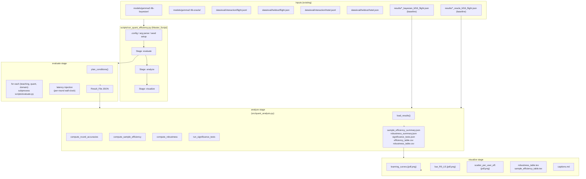
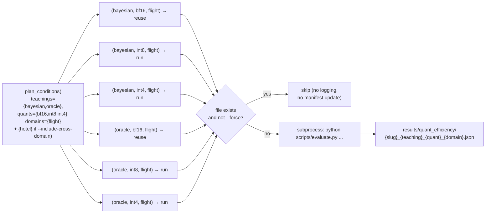

# Design Document

## Overview

본 설계 문서는 `requirements.md`에 정의된 8개 Requirement (Quantization Robustness × Sample Efficiency × Cross-Domain) 를 충족하는 **3-stage 파이프라인** (`evaluate` → `analyze` → `visualize`) 의 구조를 정의한다.

핵심 설계 원칙:

1. **기존 인프라 최대 재활용** — `src/inference.py::GemmaInference` 와 `src/evaluation.py::InteractiveEvaluator` 는 이미 bf16/int8/int4 BitsAndBytesConfig 를 지원하고 reward_fn 기반 ground-truth 를 직접 계산하므로, 양자화 매트릭스 실행은 기존 `scripts/evaluate.py` 를 6번 (또는 12번, cross-domain 포함) 호출하는 형태로 구현한다. 분석·시각화·통계 검정만 신규 모듈로 분리한다.
2. **Stage 분리와 idempotency** — 각 stage 는 디스크에 산출물을 적재하고 다음 stage 는 이를 입력으로 받는다. 이미 존재하는 결과 파일은 `--force` 없이 건너뛰어 부분 재실행을 지원한다.
3. **재현성 우선** — 단일 seed (기본 42), 단일 manifest (`run_manifest.json`), 결정론적 generation (`temperature=0.0`, greedy) 을 일관되게 적용한다. 양자화 효과가 환경 노이즈에 묻히지 않도록 하기 위함이다.
4. **분석 로직의 순수성** — 분석/검정 함수들은 디스크 I/O 없이 in-memory dict/array 만 받아 동작하는 순수 함수로 작성하여 property-based testing 으로 직접 검증 가능하게 한다.
5. **결과물의 단일 디렉토리화** — 모든 신규 산출물은 `results/quant_efficiency/` 하위로 통합하고, bf16 baseline (`results/*_bf16_flight.json`) 두 개 파일은 그대로 재사용한다 (Req 1.4).

비목표 (non-goals):

- 새로운 모델 학습 — 본 작업은 평가/분석 only.
- 새로운 도메인 데이터 수집 — Hotel 도메인 데이터 (`data/eval/{heldout,interaction}/hotel.{json,jsonl}`) 는 이미 존재함을 확인하였다.
- BitsAndBytes 외 양자화 백엔드 (GPTQ, AWQ) 지원 — 본 연구의 결론은 robustness gap 의 *상대적* 비교이므로 단일 백엔드로 충분하다.

## Architecture

### 전체 파이프라인 흐름



### 6 (또는 12) 개 Experiment_Condition 의 순차 실행

GPU 메모리 충돌을 방지하기 위해 한 condition 의 evaluate 호출이 끝난 뒤 다음 condition 으로 넘어간다. 단일 GPU 사용을 강제 (`--device-map cuda:0`) 하며, 각 condition 은 별도의 Python subprocess 로 실행하여 모델 weight 가 GPU 에서 완전히 release 되도록 한다.



### 결과 디렉토리 구조

```
results/
├── gemma2-9b-bayesian_bayesian_bf16_flight.json   # 기존 (baseline, 재사용)
├── gemma2-9b-oracle_oracle_bf16_flight.json       # 기존 (baseline, 재사용)
└── quant_efficiency/
    ├── run_manifest.json                          # Req 7.6
    ├── gemma2-9b-bayesian_bayesian_int8_flight.json
    ├── gemma2-9b-bayesian_bayesian_int4_flight.json
    ├── gemma2-9b-oracle_oracle_int8_flight.json
    ├── gemma2-9b-oracle_oracle_int4_flight.json
    ├── (cross-domain only)
    │   ├── gemma2-9b-bayesian_bayesian_bf16_hotel.json
    │   ├── gemma2-9b-bayesian_bayesian_int8_hotel.json
    │   ├── gemma2-9b-bayesian_bayesian_int4_hotel.json
    │   ├── gemma2-9b-oracle_oracle_bf16_hotel.json
    │   ├── gemma2-9b-oracle_oracle_int8_hotel.json
    │   └── gemma2-9b-oracle_oracle_int4_hotel.json
    ├── sample_efficiency_summary.json             # Req 3.5
    ├── robustness_summary.json                    # Req 4.4
    ├── robustness_table.csv                       # Req 4.4
    ├── significance_tests.json                    # Req 5.4
    ├── efficiency_table.csv                       # Req 2.4
    ├── figures/
    │   ├── learning_curves.{pdf,png}              # Req 6.1
    │   ├── bar_R5_LE.{pdf,png}                    # Req 6.2
    │   ├── scatter_per_user_eff.{pdf,png}         # Req 6.3
    │   ├── (cross-domain only) cross_domain_robustness.{pdf,png}  # Req 8.3
    │   └── captions.md                            # Req 6.5
    └── tables/
        ├── robustness_table.tex                   # Req 6.6
        └── sample_efficiency_table.tex            # Req 6.6
```

## Components and Interfaces

### 1. `scripts/run_quant_efficiency.py` (신규, Master_Script)

전체 파이프라인의 단일 진입점. argparse 로 stage/force/cross-domain 을 받아 단계를 dispatch 한다.

**CLI**:

```
python scripts/run_quant_efficiency.py \
    --stage {evaluate,analyze,visualize,all} \
    [--force] \
    [--include-cross-domain] \
    [--seed 42] \
    [--bayesian-model models/gemma2-9b-bayesian] \
    [--oracle-model models/gemma2-9b-oracle] \
    [--output-dir results/quant_efficiency] \
    [--max-users N]   # smoke test
```

**핵심 함수 시그니처**:

```python
# Pure planning logic — no side effects, easily testable.
def plan_conditions(
    teachings: list[str],
    quants: list[str],
    domains: list[str],
    model_paths: dict[str, str],   # teaching -> model_path
) -> list[ExperimentCondition]:
    """
    Cartesian product expansion. Returns deterministically ordered list of
    ExperimentCondition records. Order: domain → teaching → quant.
    """

def resolve_result_path(
    cond: ExperimentCondition,
    output_dir: Path,
    legacy_results_dir: Path,   # results/
) -> Path:
    """
    Path resolution rule (Req 1.4 / 7.7):
      - If a baseline file exists at legacy_results_dir for (teaching, bf16,
        flight), return that path.
      - Otherwise, return output_dir / f"{slug}_{teaching}_{quant}_{domain}.json".
    """

def should_skip(path: Path, force: bool) -> bool:
    """Pure predicate. Skip if path exists AND not force."""

def run_evaluate_stage(
    plan: list[ExperimentCondition],
    output_dir: Path,
    seed: int,
    force: bool,
    max_users: int | None,
) -> list[Path]:
    """
    For each condition not skipped, spawn subprocess of scripts/evaluate.py.
    Returns the list of result paths that exist after the stage (skipped +
    newly produced).
    """

def run_analyze_stage(result_paths: list[Path], output_dir: Path) -> dict:
    """Calls into src.quant_analysis. Returns summary dict."""

def run_visualize_stage(output_dir: Path, include_cross_domain: bool) -> None:
    """Calls into src.quant_visualize."""

def write_run_manifest(
    output_dir: Path,
    plan: list[ExperimentCondition],
    seed: int,
    started_at: datetime,
) -> Path:
    """Records env metadata (git sha, python/torch/transformers/bnb versions,
    GPU name) and the planned conditions."""
```

**ExperimentCondition** (frozen dataclass):

```python
@dataclass(frozen=True)
class ExperimentCondition:
    teaching: str            # "bayesian" | "oracle"
    quantization: str        # "bf16" | "int8" | "int4"
    domain: str              # "flight" | "hotel"
    model_path: str
    model_slug: str          # Path(model_path).name
```

### 2. `src/inference.py` (수정, Inference_Engine)

기존 코드는 거의 그대로 유지하되, **Req 2.5** 충족을 위해 메모리 측정 일관성 보강.

**수정 위치**: `GemmaInference.__init__` 의 모델 로드 직전 + `get_memory_usage()`.

```python
# In GemmaInference.__init__, just before AutoModelForCausalLM.from_pretrained:
if torch.cuda.is_available():
    torch.cuda.empty_cache()
    torch.cuda.reset_peak_memory_stats(self._device_for_reset())

# Extend get_memory_usage() to also report peak (Req 2.1, 2.5):
def get_memory_usage(self) -> dict:
    if not torch.cuda.is_available():
        return {"allocated_mib": 0.0, "reserved_mib": 0.0, "peak_mib": 0.0}
    dev = self._device()
    return {
        "allocated_mib": torch.cuda.memory_allocated(dev) / (1024**2),
        "reserved_mib":  torch.cuda.memory_reserved(dev)  / (1024**2),
        "peak_mib":      torch.cuda.max_memory_allocated(dev) / (1024**2),
    }
```

`generate()` / `generate_batch()` 시그니처 변경 없음. 양자화 분기 (`int8`/`int4`/`None`) 도 유지.

### 3. `src/evaluation.py` (최소 수정, Latency 측정 추가)

`InteractiveEvaluator.evaluate_user` 내부에서 라운드별 wall-clock 시간과 응답 토큰 수를 수집하도록 보강. 기존 `RoundResult` 에 두 필드를 추가한다.

```python
@dataclass
class RoundResult:
    round_idx: int
    response: str
    prediction_0idx: Optional[int]
    ground_truth_0idx: int
    correct: bool
    parse_ok: bool
    # NEW (Req 2.3):
    generation_seconds: float          # time of single .generate() call
    response_tokens: int               # len(tokenizer.encode(response, add_special_tokens=False))
```

`evaluate_all()` summary 에 `latency` 서브 객체를 추가:

```python
summary["latency"] = {
    "mean_seconds_per_round": float,
    "mean_seconds_per_user":  float,
    "mean_tokens_per_round":  float,
    "per_round_seconds":      list[float],   # length = num_rounds
}
```

빈 응답 (`response_tokens == 0`) 라운드도 wall-clock 시간은 누락 없이 기록 (Req 2.3 후반).

### 4. `src/quant_analysis.py` (신규)

순수 함수만 포함하는 분석 모듈. 모든 함수는 dict/list 입력 → dict 출력. 디스크 I/O 는 thin wrapper (`load_results_from_dir`, `save_*_summary`) 에서만 일어난다.

**핵심 함수**:

```python
def load_results_from_dir(
    base_results_dir: Path,
    quant_results_dir: Path,
) -> dict[ConditionKey, ResultFile]:
    """
    ConditionKey = (teaching, quant, domain).
    Loads bf16 baselines from base_results_dir and int8/int4 (and any hotel)
    from quant_results_dir. Filename pattern: {slug}_{teaching}_{quant}_{domain}.json
    """

def compute_round_accuracies(per_user: list[dict], num_rounds: int = 5) -> list[float]:
    """Aggregates per-user round traces to round_accuracies[r]. Mirrors
    InteractiveEvaluator.evaluate_all() aggregation but as a pure function."""

def compute_per_user_round_correctness(
    per_user: list[dict], num_rounds: int = 5
) -> np.ndarray:
    """Returns shape (num_users, num_rounds) bool array of correct flags.
    Foundational primitive used by every downstream analysis."""

def compute_sample_efficiency(
    correct_matrix: np.ndarray,   # (U, R) bool
) -> dict:
    """
    Returns:
      {
        "R1": float, ..., "R5": float,
        "LE":             R5 - R1,
        "sample_efficiency_score": R3 - R1,
        "AUC":            trapezoidal integral of [R1..R5] over x = [1..5],
                          normalized by (R-1) so AUC ∈ [0, 1].
                          Formula: ((R1+R5)/2 + R2+R3+R4) / 4.
        "convergence_round_relative":  per-user array, see _convergence_relative,
        "convergence_round_absolute":  per-user array, see _convergence_absolute,
        "convergence_round_mean":       float (combining both, see Algorithms),
        "convergence_round_median":     float,
        "learning_curve_std":           float,   # std over users of per-user
                                                 # cumulative round accuracy
      }
    """

def _convergence_relative(
    correct_matrix: np.ndarray,   # (U, R)
    r5_threshold: float,          # R5 of THIS condition
    factor: float = 0.8,
) -> np.ndarray:
    """
    For each user u, returns the smallest round r such that the user's
    cumulative accuracy through round r is >= factor * r5_threshold.
    Users that never reach the threshold are right-censored to (R+1).
    """

def _convergence_absolute(
    correct_matrix: np.ndarray, threshold: int = 3
) -> np.ndarray:
    """For each user u, smallest round r such that cumulative correct count
    in rounds 1..r is >= threshold. Censored to (R+1) if not reached."""

def compute_robustness(
    per_condition: dict[ConditionKey, dict],   # output of compute_sample_efficiency keyed by condition
) -> dict:
    """
    For teaching in {bayesian, oracle}:
      delta_R5_int8 = R5_bf16 - R5_int8
      delta_R5_int4 = R5_bf16 - R5_int4
      delta_LE_int8 = LE_bf16 - LE_int8
      delta_LE_int4 = LE_bf16 - LE_int4
    Robustness_Gap (int8) = (delta_R5_oracle - delta_R5_bayesian),
                            (delta_LE_oracle - delta_LE_bayesian)
    Robustness_Gap (int4) similarly.
    Per-user delta_LE: only meaningful if user_idxs match across teachings;
                      we align by `user_idx` and compute mean/median/IQR.
    """

def run_significance_tests(
    per_user_delta_le: dict[str, np.ndarray],   # 'int8'/'int4' -> (U,) per-user Δ_LE
    bayesian_per_user_delta: dict[str, np.ndarray],
    oracle_per_user_delta:   dict[str, np.ndarray],
) -> dict:
    """
    Paired Wilcoxon signed-rank on (oracle_per_user_delta - bayesian_per_user_delta)
    for each quant ∈ {int8, int4}. Reports test statistic, p-value, n_pairs,
    rank-biserial correlation. Optionally adds paired t-test if Shapiro–Wilk
    p > 0.05 on the difference vector. interpretation = textual summary.
    """
```

**디스크 출력 wrapper**:

```python
def write_sample_efficiency_summary(out: Path, by_cond: dict) -> None: ...
def write_robustness_summary(out: Path, robustness: dict) -> None: ...
def write_significance_tests(out: Path, tests: dict) -> None: ...
def write_efficiency_table_csv(out: Path, results: dict) -> None: ...
def write_robustness_table_csv(out: Path, robustness: dict) -> None: ...
```

모든 wrapper 는 atomic write 를 사용 (임시 파일 → `os.replace`).

### 5. `src/quant_visualize.py` (신규, Figure_Generator)

matplotlib 기반. **모든 figure 를 메모리에 생성한 뒤** (Req 6.4 의 ordering 요구) 단계 마지막에 `savefig` 를 일괄 호출한다.

**핵심 함수**:

```python
def make_learning_curves_figure(
    by_cond: dict[ConditionKey, list[float]],   # round_accuracies
    domain: str = "flight",
) -> matplotlib.figure.Figure:
    """6 lines: (Bayesian/Oracle) × (bf16/int8/int4). Color = teaching, linestyle = quant."""

def make_r5_le_bar_figure(by_cond: dict) -> Figure:
    """Two grouped bar charts: R5 and LE. x = quant, hue = teaching."""

def make_scatter_per_user_efficiency(
    bayesian_eff: np.ndarray,    # (U,) per-user sample_efficiency_score for bayesian/bf16
    oracle_eff:   np.ndarray,    # aligned by user_idx
) -> Figure:
    """y = x reference line. Points above = users where Bayesian is more efficient."""

def make_cross_domain_robustness_figure(robustness_flight: dict, robustness_hotel: dict) -> Figure:
    """Used only when --include-cross-domain. Side-by-side bars, x = quant, hue = domain, panels = teaching."""

def save_figures(figures: list[tuple[str, Figure]], out_dir: Path) -> None:
    """Saves each fig as both .pdf and .png (300 dpi). Only runs after every
    figure in the list is non-None — implements Req 6.4 ordering."""

def write_robustness_latex_table(robustness: dict, out: Path) -> None:
    """booktabs format. Columns: Teaching, Quant, R1, R5, LE, Δ_R5, Δ_LE."""

def write_sample_efficiency_latex_table(by_cond: dict, out: Path) -> None:
    """booktabs format. Columns: Teaching, Quant, R3-R1, AUC, Convergence_Round."""

def write_captions_md(out: Path, captions: dict[str, str]) -> None:
    """Korean captions, one Markdown header per figure."""
```

축/범례/제목은 영문, 캡션은 한글 (Req 6.5).

## Data Models

### Result_File JSON 스키마 (Req 1.5, 2.3)

```json
{
  "model_path": "models/gemma2-9b-bayesian",
  "model_slug": "gemma2-9b-bayesian",
  "teaching":   "bayesian",
  "quantization": "int8",
  "domain":     "flight",
  "num_rounds": 5,
  "max_users":  null,
  "timestamp":  "2025-01-30T15:42:00",
  "memory_mib": {
    "allocated_mib": 9123.4,
    "reserved_mib":  9456.7,
    "peak_mib":     10234.5
  },
  "elapsed_seconds_total": 4321.5,
  "summary": {
    "num_users": 624,
    "num_rounds": 5,
    "round_accuracies":          [0.31, 0.42, 0.55, 0.63, 0.69],
    "learning_effect":           0.38,
    "parse_failure_rate":        0.012,
    "per_round_parse_failures":  [4, 3, 2, 5, 1],
    "elapsed_seconds":           4321.5,
    "latency": {
      "mean_seconds_per_round": 1.21,
      "mean_seconds_per_user":  6.05,
      "mean_tokens_per_round":  18.4,
      "per_round_seconds":      [1.34, 1.22, 1.18, 1.20, 1.11]
    }
  },
  "per_user": [
    {
      "user_idx": 0,
      "rounds": [
        {
          "round_idx": 0,
          "response": "The best option is Flight 2 ...",
          "prediction_0idx": 1,
          "ground_truth_0idx": 1,
          "correct": true,
          "parse_ok": true,
          "generation_seconds": 1.34,
          "response_tokens": 19
        }
      ]
    }
  ]
}
```

### `sample_efficiency_summary.json` 스키마 (Req 3.5)

```json
{
  "schema_version": 1,
  "domain": "flight",
  "by_condition": {
    "bayesian/bf16/flight": {
      "R1": 0.385, "R2": 0.503, "R3": 0.602, "R4": 0.671, "R5": 0.708,
      "LE": 0.323,
      "sample_efficiency_score": 0.217,
      "AUC": 0.581,
      "convergence_round_relative": {"mean": 3.12, "median": 3.0, "censored_count": 24},
      "convergence_round_absolute": {"mean": 3.45, "median": 3.0, "censored_count": 31},
      "convergence_round_mean":   3.12,
      "convergence_round_median": 3.0,
      "learning_curve_std": 0.187
    },
    "bayesian/int8/flight": { "...": "..." },
    "...": "..."
  }
}
```

### `robustness_summary.json` 스키마 (Req 4.4)

```json
{
  "schema_version": 1,
  "domain": "flight",
  "per_teaching": {
    "bayesian": {
      "R1_bf16": 0.385, "R5_bf16": 0.708, "LE_bf16": 0.323,
      "R1_int8": 0.371, "R5_int8": 0.682, "LE_int8": 0.311,
      "R1_int4": 0.350, "R5_int4": 0.640, "LE_int4": 0.290,
      "delta_R5_int8": 0.026, "delta_R5_int4": 0.068,
      "delta_LE_int8": 0.012, "delta_LE_int4": 0.033,
      "per_user_delta_LE_int8": {"mean": 0.012, "median": 0.0, "iqr": [0.0, 0.04]},
      "per_user_delta_LE_int4": {"mean": 0.033, "median": 0.02, "iqr": [0.0, 0.08]}
    },
    "oracle": { "...": "..." }
  },
  "robustness_gap": {
    "int8": {
      "delta_R5_oracle_minus_bayesian": 0.041,
      "delta_LE_oracle_minus_bayesian": 0.029
    },
    "int4": {
      "delta_R5_oracle_minus_bayesian": 0.082,
      "delta_LE_oracle_minus_bayesian": 0.061
    }
  }
}
```

### `significance_tests.json` 스키마 (Req 5.4)

```json
{
  "schema_version": 1,
  "tests": [
    {
      "test_name": "wilcoxon_paired_per_user_delta_LE_int8",
      "statistic": 8421.0,
      "p_value":   0.0032,
      "n_pairs":   624,
      "effect_size": {"name": "rank_biserial_r", "value": 0.21},
      "interpretation": "Bayesian has smaller per-user Δ_LE than Oracle at int8 (p=0.0032)."
    },
    {
      "test_name": "paired_t_per_user_delta_LE_int8",
      "statistic": 2.83,
      "p_value":   0.0048,
      "n_pairs":   624,
      "effect_size": {"name": "cohens_d", "value": 0.13},
      "interpretation": "Auxiliary t-test agrees with Wilcoxon (p=0.0048)."
    }
  ]
}
```

### `run_manifest.json` 스키마 (Req 7.6)

```json
{
  "schema_version": 1,
  "timestamp":      "2025-01-30T15:42:00",
  "git_commit_sha": "a1b2c3d...",
  "python_version": "3.11.7",
  "torch_version":  "2.4.0+cu121",
  "transformers_version": "4.46.3",
  "bnb_version":    "0.43.3",
  "gpu_name":       "NVIDIA RTX A5000",
  "gpu_count":      8,
  "seed":           42,
  "stage":          "all",
  "include_cross_domain": false,
  "force":          false,
  "conditions": [
    {
      "teaching": "bayesian",
      "quantization": "bf16",
      "domain": "flight",
      "model_slug": "gemma2-9b-bayesian",
      "result_path": "results/gemma2-9b-bayesian_bayesian_bf16_flight.json",
      "status": "reused",
      "flagged": false
    },
    {
      "teaching": "bayesian",
      "quantization": "int8",
      "domain": "flight",
      "model_slug": "gemma2-9b-bayesian",
      "result_path": "results/quant_efficiency/gemma2-9b-bayesian_bayesian_int8_flight.json",
      "status": "produced",
      "flagged": false
    }
  ]
}
```

`status` 값: `produced` (이번 실행에서 생성), `reused` (기존 baseline 재활용), `skipped` (force 없이 이미 존재) — 단, Req 7.7 에 따라 `skipped` condition 은 manifest 에서 제외하거나 별도 표기를 하지 않는다 (manifest 갱신 없이 완전히 건너뛴다는 요건). `reused` 와 `produced` 만 manifest 에 기록한다.

## 분석 알고리즘 정의

분석 단계의 모든 정량 지표는 분명한 수식으로 정의되어야 단위 테스트가 가능하다. 수식과 그 정당화를 명시한다.

### Round_Accuracy (per-condition, per-round)

per-user round trace 의 boolean correctness 매트릭스 `C ∈ {0,1}^{U×R}` 에 대해

```
R_r = (1/U) * sum_{u=1..U} C[u, r]                  for r = 1..R
```

### Sample_Efficiency_Score

두 가지 정의를 동시에 보고 (**Req 3.2**).

1. **Slope-form**: `R3 - R1`. 초기 3라운드까지의 학습 진행도. 단순하고 해석 쉬움.
2. **AUC-form**: 라운드 1..5 정확도 곡선의 사다리꼴 적분 (normalized).

   ```
   AUC = ((R1 + R5) / 2 + R2 + R3 + R4) / (R - 1)
       = ((R1 + R5) / 2 + R2 + R3 + R4) / 4    (R=5)
   ```

   `numpy.trapz([R1..R5], x=[1..5]) / (R-1)` 와 동치이며 결과적으로 `[0, 1]` 범위. 곡선 전체의 학습 효율을 한 스칼라로 압축.

per-user 버전은 `C[u, :]` 의 cumulative running mean 을 곡선으로 간주하여 동일 공식을 적용.

### Convergence_Round (per-user)

두 가지 정의 (**Req 3.3**).

1. **Relative threshold**: `factor=0.8`, `r5_threshold = R5_condition`.

   ```
   conv_rel(u) = min { r ∈ {1..R} :
                       (1/r) * sum_{r'=1..r} C[u, r'] >= 0.8 * R5_condition }
   ```

   미도달 시 `R + 1` 로 right-censored.

2. **Absolute correct count**: `threshold=3`.

   ```
   conv_abs(u) = min { r ∈ {1..R} :
                       sum_{r'=1..r} C[u, r'] >= 3 }
   ```

   미도달 시 `R + 1`.

각각의 mean / median / censored_count 를 `sample_efficiency_summary.json` 에 기록. Top-level `convergence_round_mean` 과 `convergence_round_median` 은 `convergence_round_relative` 의 값을 사용 (요약 테이블의 일관성을 위해 한 가지를 표면 노출).

### Robustness_Drop / Robustness_Gap (Req 4)

```
delta_R5(t, q) = R5(t, bf16, flight) - R5(t, q, flight)        for q ∈ {int8, int4}
delta_LE(t, q) = LE(t, bf16, flight) - LE(t, q, flight)
```

per-user Δ_LE: 사용자 u 의 boolean trace `C(t, q, u, :)` 로부터 user-level LE 를 `C[u, R-1] - C[u, 0]` (∈ {-1, 0, 1}) 로 정의하고

```
delta_LE_user(t, q, u) = LE(t, bf16, u) - LE(t, q, u)
```

Robustness_Gap:

```
gap_R5(q) = delta_R5(oracle, q) - delta_R5(bayesian, q)
gap_LE(q) = delta_LE(oracle, q) - delta_LE(bayesian, q)
```

양수이면 Bayesian 이 양자화에 더 강건 (가설과 일치).

### 통계 검정 (Req 5)

per-user paired vector:

```
diff_LE(q, u) = delta_LE_user(oracle, q, u) - delta_LE_user(bayesian, q, u)
```

- **Wilcoxon signed-rank**: `scipy.stats.wilcoxon(diff_LE(q, :), zero_method='wilcox', alternative='two-sided')`. 통계량 `W`, `p`, `n_pairs = (diff != 0).sum()`.
- **Effect size (rank-biserial r)**:

  ```
  r_rb = (W_pos - W_neg) / (W_pos + W_neg)
       = 1 - 2 * W_neg / (n * (n+1) / 2)
  ```

  여기서 `W_pos`, `W_neg` 는 양/음 차이의 rank sum. scipy 1.7+ 의 결과에서 `result.statistic` 은 `W_pos` 임.

- **Paired t-test**: `scipy.stats.ttest_rel(oracle_LE_drop, bayesian_LE_drop)`. Cohen's d:

  ```
  d = mean(diff) / std(diff, ddof=1)
  ```

- **정규성 가정 체크**: `scipy.stats.shapiro(diff_LE)` p > 0.05 일 때만 t-test 결과를 "보조 지표" 로 보고, 그렇지 않을 때는 t-test 결과의 `interpretation` 에 정규성 위배 경고 포함.

- p < 0.05 인 경우 stdout 에 `\033[1m` 으로 강조 출력 (Req 5.5).

## Correctness Properties

*A property is a characteristic or behavior that should hold true across all valid executions of a system-essentially, a formal statement about what the system should do. Properties serve as the bridge between human-readable specifications and machine-verifiable correctness guarantees.*

분석/플래닝 로직 대부분이 **순수 함수** 이고 입력 공간이 풍부 (라운드별 정확도, per-user boolean trace, condition tuple) 하므로 본 feature 는 PBT 가 매우 적합하다. 모델 inference 자체는 외부 (HF Transformers, GPU) 와 연결되어 있으므로 PBT 가 부적합하며, 해당 부분은 통합 테스트로 처리한다.

### Property 1: Quantization 라벨 white-list

*For all* `quantization` argument values, `GemmaInference` 와 `scripts/run_quant_efficiency.py` 와 결과 파일명 라벨은 정확히 `{"bf16", "int8", "int4"}` 중 하나를 사용한다. 그 외의 값으로 호출하면 즉시 `ValueError` 를 발생시킨다 (silent fallback 금지).

**Validates: Requirements 1.1, 1.3, 7.1, 7.2**

### Property 2: Result file path 패턴 round-trip

*For all* `(model_slug, teaching, quant, domain)` 튜플에 대해, `resolve_result_path` 가 만든 파일명을 다시 파싱하면 원래 튜플이 복원된다. 즉 `parse(format(t)) == t`. 또한 분석 단계의 `load_results_from_dir` 가 디스크에서 발견한 파일에서 추출한 condition key 는 원본 condition key 와 일치한다.

**Validates: Requirements 1.3, 8.4**

### Property 3: Robustness drop 의 산술적 일관성

*For all* condition pair `(t, bf16)` 와 `(t, q)` (단, R5 가 정의된 경우),

- `delta_R5(t, q) == R5(t, bf16) - R5(t, q)`
- `delta_LE(t, q) == LE(t, bf16) - LE(t, q)`
- `gap_R5(q) == delta_R5(oracle, q) - delta_R5(bayesian, q)`
- 만약 모든 condition 에서 R5 가 동일하면 `delta_R5 == 0` 이고 `gap_R5 == 0`.

또한 `delta_R5` 와 `delta_LE` 는 R5/LE 입력값에 대해 선형성을 만족한다.

**Validates: Requirements 4.1, 4.2, 4.3**

### Property 4: AUC = 사다리꼴 적분 정의 일치

*For all* round-accuracy 벡터 `[R1, R2, R3, R4, R5] ∈ [0,1]^5`,

```
compute_AUC([R1..R5]) == ((R1 + R5) / 2 + R2 + R3 + R4) / 4
                     == numpy.trapz([R1..R5], x=[1..5]) / 4
```

특수 케이스 invariant:

- 모든 라운드 정확도가 동일 (`R1 = ... = R5 = a`) 이면 `AUC == a`.
- 모든 라운드가 0 이면 `AUC == 0`, 모두 1 이면 `AUC == 1`.
- 입력에 epsilon 만큼 아핀 변환을 가하면 AUC 도 같은 양만큼 변화 (선형성).

**Validates: Requirement 3.2**

### Property 5: Skip 정책의 idempotency

*For all* `(plan, force=False)` 입력에 대해, `run_evaluate_stage` 를 두 번 연속 호출했을 때:

- 첫 번째 호출 후 디스크에 존재하는 결과 파일들의 mtime / 내용 / size 는 두 번째 호출 후에도 동일하다 (재실행 없음).
- `--force` 를 사용한 경우에만 mtime 이 갱신된다.
- 두 번째 호출은 `run_manifest.json` 에 동일한 condition 에 대한 새 entry 를 추가하지 않는다 (Req 7.7 에 따라 skipped condition 은 매니페스트에서 제외).

**Validates: Requirements 1.4, 7.7**

### Property 6: Convergence_Round 의 단조 도달성

*For all* per-user boolean trace `C[u, :] ∈ {0,1}^R`,

- `conv_abs(u, threshold=k)` 는 `1 ≤ conv_abs ≤ R+1`.
- `sum(C[u, :]) >= k` ⟺ `conv_abs(u, k) ≤ R`.
- `conv_abs(u, k)` 는 `k` 에 대해 monotone non-decreasing.
- `conv_rel` 도 동일한 단조 도달 invariant 를 만족 (threshold 가 클수록 도달 라운드 ≥).
- 모든 라운드 정답인 trace 는 `conv_abs(u, k) = k` for `k ≤ R`.
- 모든 라운드 오답인 trace 는 항상 `R + 1` (right-censored).

**Validates: Requirement 3.3**

### Property 7: 파일 산출물 무결성과 ordering

*For all* visualization 호출에 대해,

- `save_figures` 는 입력 figure 리스트 안에 None 이 하나라도 있으면 어떤 파일도 디스크에 쓰지 않는다 (atomic ordering 보장, Req 6.4).
- `figures/captions.md` 의 각 캡션 헤더는 디스크에 존재하는 figure 파일과 1:1 대응 (orphan caption 또는 missing caption 없음).
- Cross-domain placeholder 파일은 `--include-cross-domain` 이 지정되지 않은 실행에서 절대 생성되지 않는다 (Req 8.4).

**Validates: Requirements 6.4, 8.4**

## Error Handling

### CUDA OOM (Out-of-Memory)

- **발생 위치**: `GemmaInference.__init__` (모델 로드) 또는 `generate*()` (forward).
- **처리**: subprocess 단위로 격리되어 있으므로 OOM 은 해당 condition 의 subprocess 만 죽인다. Master_Script 는 subprocess return code != 0 을 감지하면:
  1. 해당 condition 의 출력 파일이 partial 인지 확인 (atomic write 미적용 시) → `delete_partial_file()` 로 정리.
  2. `run_manifest.json` 의 해당 condition 에 `status="failed"`, `error="cuda_oom"` 기록.
  3. 다음 condition 으로 진행 (전체 파이프라인 중단하지 않음).
- **재현성**: int4 → int8 → bf16 순으로 재시도 가능하도록 `--from-condition` 옵션 (선택적) 제공.

### bitsandbytes 미설치

- **검출**: Master_Script 시작 시 `import bitsandbytes` 시도. ImportError 발생 시 `--quantization` 이 `int8`/`int4` 인 모든 condition 을 skip 하고 stderr 에 명확한 메시지 출력. bf16 만 진행.
- **fallback 금지**: 사용자 요구 환경에서 bnb 가 설치되어 있다고 명시되었으므로, 정상 실행 시에는 fallback 경로가 trigger 되지 않는다.

### 결과 파일 partial write 방지

모든 디스크 쓰기는 atomic write 패턴 사용:

```python
def atomic_write_json(path: Path, payload: dict) -> None:
    tmp = path.with_suffix(path.suffix + ".tmp")
    with open(tmp, "w") as f:
        json.dump(payload, f, indent=2)
    os.replace(tmp, path)   # POSIX rename, atomic on same filesystem
```

`scripts/evaluate.py` 도 `save_results` 를 atomic 으로 수정. 이로써 SIGINT/OOM 으로 evaluate 가 죽어도 partial JSON 이 디스크에 남지 않아 skip 정책 (Req 7.7) 이 안전하게 동작한다.

### Hotel 데이터 미존재

- `--include-cross-domain` 지정 시, Master_Script 는 stage `evaluate` 시작 전에 `data/eval/heldout/hotel.json` 와 `data/eval/interaction/hotel.jsonl` 의 존재를 검사.
- 둘 중 하나라도 없으면 `FileNotFoundError` 와 명확한 메시지 (`"Cross-domain evaluation requires data/eval/{heldout,interaction}/hotel.{json,jsonl}"`) 로 즉시 종료. 어떤 placeholder 파일도 생성하지 않음 (Req 8.4).
- `--include-cross-domain` 이 지정되지 않으면 hotel 파일을 일체 참조하지 않음.

### Parse failure rate > 0.05 임계 초과 (Req 1.6)

- evaluate 단계에서 condition 별 `parse_failure_rate` 가 0.05 초과 시 stdout warning + manifest entry `flagged=true`.
- 분석 단계는 `flagged=true` condition 도 정상 집계하되, 통계 검정 결과의 `interpretation` 에 "한 condition 에 parse failure 가 5% 초과" 경고 부착.

### 빈 result file / 손상된 JSON

- `load_results_from_dir` 는 각 파일에 대해 `try: json.load + 스키마 키 존재 검증`. 손상된 파일은 `BrokenResultFileError` 와 함께 raise 하고 분석 단계 전체를 abort (silent skip 금지, 잘못된 통계가 산출될 위험 차단).

### 통계 검정의 degenerate input

- `n_pairs == 0` 또는 모든 `diff == 0` 인 경우 Wilcoxon 은 정의되지 않음 → 결과 dict 에 `statistic=None`, `p_value=None`, `interpretation="degenerate"` 기록하고 계속 진행.

## Testing Strategy

### 테스트 도구

- **단위 + property 테스트**: `pytest` + `hypothesis` (Python).
- **수치 검증**: `numpy.testing.assert_allclose` (rtol=1e-9, atol=1e-12).
- **통계 검증**: `scipy.stats` 의 직접 호출 결과를 기준으로 비교.
- **Subprocess 통합 테스트**: `pytest` + `subprocess.run` + 미니 mock model (별도 fixture).

### 테스트 파일 구조

```
tests/
├── __init__.py
├── conftest.py                        # 공통 fixture (fake result file 생성기 등)
├── unit/
│   ├── test_quant_analysis_basics.py        # round_accuracies, AUC 단위 테스트
│   ├── test_quant_analysis_properties.py    # Hypothesis: Property 3, 4, 6
│   ├── test_planning.py                     # plan_conditions, resolve_result_path
│   ├── test_planning_properties.py          # Hypothesis: Property 1, 2
│   └── test_visualize.py                    # captions ↔ figures 일관성, Property 7
├── integration/
│   ├── test_master_stage_dispatch.py        # mock subprocess 로 stage 분기 검증
│   ├── test_skip_idempotency.py             # Property 5 (디스크 mtime 비교)
│   └── test_atomic_write.py                 # SIGINT 시뮬레이션, partial 파일 미잔존
└── data/
    └── fake_results/                        # 미니 result JSON 들
```

### 단위 테스트 (예시)

- `test_compute_round_accuracies__manual_example`: hand-crafted per_user 로 known round_accuracies 일치.
- `test_compute_AUC__all_equal_returns_input`: `AUC([a]*5) == a` for `a ∈ {0, 0.5, 1}`.
- `test_compute_AUC__formula_matches_numpy_trapz`: `compute_AUC(rs) == np.trapz(rs, x=[1..5]) / 4`.
- `test_robustness_drop__simple_subtraction`: known R5_bf16/R5_int8 로 delta_R5 검증.
- `test_convergence_absolute__all_correct_returns_threshold`: `[1,1,1,1,1]` trace + threshold=3 → conv_abs=3.
- `test_convergence_absolute__all_wrong_returns_R_plus_1`: `[0,0,0,0,0]` → conv_abs=6.
- `test_resolve_result_path__bf16_uses_legacy_dir`: bf16 condition 은 `results/` 의 baseline 을 가리킴.
- `test_should_skip__exists_no_force_returns_true`.

### Property-based 테스트 (Hypothesis)

각 테스트는 `--hypothesis-seed=0` (고정) + `max_examples=200` 이상.

```python
@given(
    rs=st.lists(st.floats(min_value=0, max_value=1), min_size=5, max_size=5),
)
@settings(max_examples=200)
def test_property_4_AUC_matches_trapezoidal(rs):
    """Feature: quantization-and-sample-efficiency, Property 4:
    For all round-accuracy vectors, AUC equals trapezoidal integral."""
    auc = compute_AUC(rs)
    expected = ((rs[0] + rs[4]) / 2 + rs[1] + rs[2] + rs[3]) / 4
    assert math.isclose(auc, expected, abs_tol=1e-12)
    assert math.isclose(auc, float(np.trapz(rs, x=np.arange(1, 6))) / 4, abs_tol=1e-12)


@given(
    correct=arrays(dtype=bool, shape=st.tuples(st.integers(1, 100), st.just(5))),
    threshold=st.integers(min_value=1, max_value=5),
)
@settings(max_examples=200)
def test_property_6_convergence_absolute_invariants(correct, threshold):
    """Feature: quantization-and-sample-efficiency, Property 6:
    For all per-user boolean traces, conv_abs satisfies stated invariants."""
    conv = _convergence_absolute(correct, threshold=threshold)
    R = correct.shape[1]
    assert ((1 <= conv) & (conv <= R + 1)).all()
    cum_correct = correct.sum(axis=1)
    reached = conv <= R
    assert (reached == (cum_correct >= threshold)).all()
```

### 통합 테스트

- **`test_master_stage_dispatch`**: `subprocess.run` 을 monkeypatch 한 fake (immediate return success + writes a fake JSON) 로 `--stage evaluate` 가 정확히 4 condition (bf16 baseline 2 개는 reuse) 의 subprocess 를 호출하는지 검증.
- **`test_skip_idempotency`** (Property 5): 두 번 연속 evaluate stage 실행 → mtime 비교 + manifest 의 produced 항목 수가 첫 호출 = 4, 두 번째 호출 = 0 (모두 skip).
- **`test_atomic_write`**: 큰 result dict 를 쓰는 도중 KeyboardInterrupt 시뮬레이션 → final path 에 partial JSON 미존재 검증.

### 테스트 정책

- **PBT 적용 범위**: 분석/플래닝 함수 (순수 함수만). Inference / GPU / file system race condition 은 통합 테스트 + manual smoke test 로 검증.
- **PBT iteration**: 각 property 테스트는 minimum 100 examples (`hypothesis.settings(max_examples=200)`).
- **PBT 태깅**: 각 테스트 docstring 에 `Feature: quantization-and-sample-efficiency, Property N: <title>` 명시.
- **Smoke test**: `python scripts/run_quant_efficiency.py --stage evaluate --max-users 5 --quants int4` 로 5명 사용자만 평가하여 end-to-end 동작 확인. CI 에는 포함하지 않으며 (GPU 필요), 수동 실행.
- **분석 stage CI 호환성**: 분석/시각화 단위 테스트는 GPU 불필요 → 일반 CI 에서 실행 가능.

### 테스트 환경

- conda env: `sft` (`/home/sdh/miniconda3/envs/sft/bin/python`).
- 의존성 추가: `pytest`, `hypothesis` (sft env 에 미설치 시 `pip install pytest hypothesis` 한 줄 추가).
