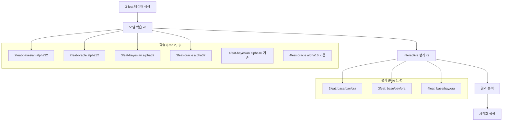
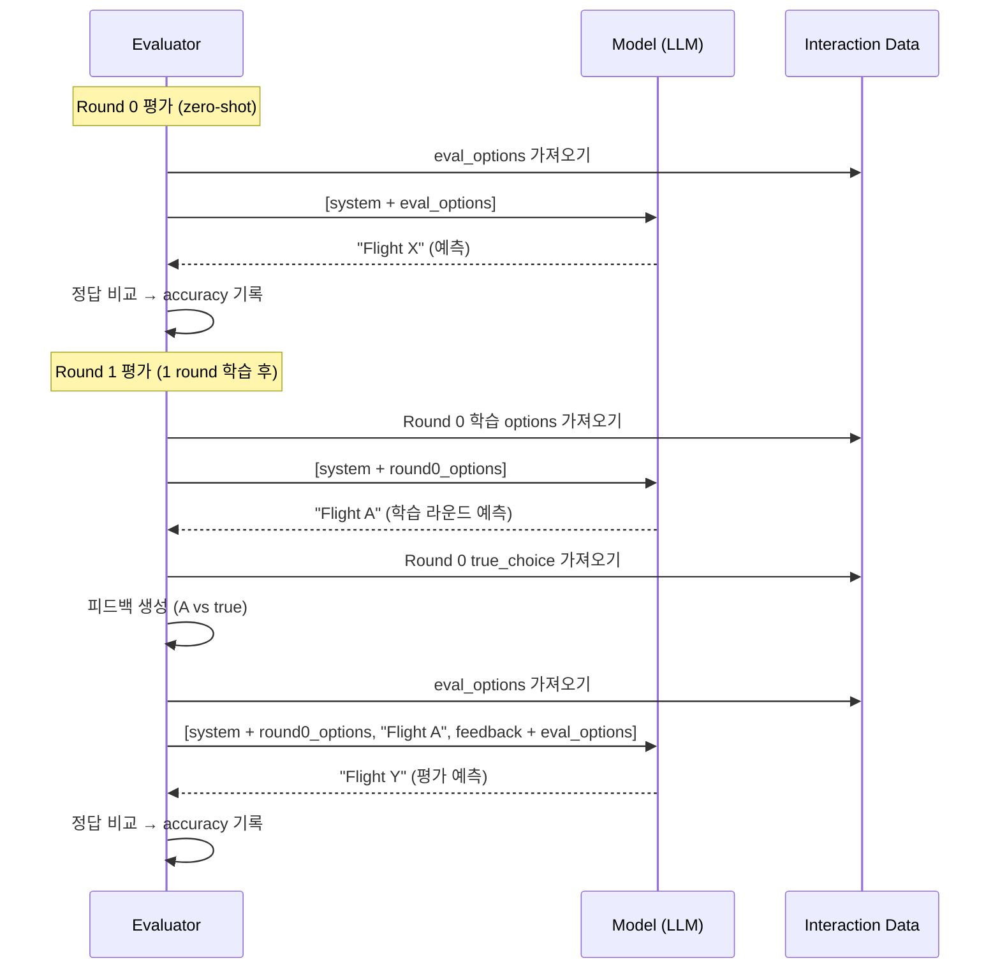

# Design Document: Research Pivot — Task Complexity

## Overview

본 설계는 Bayesian Teaching 연구의 두 가지 근본 문제(비대화형 평가, 보수적 LoRA alpha)를 수정하고, 2/3/4-feature 복잡도별 실험을 체계적으로 수행하기 위한 코드 변경과 실험 파이프라인을 정의한다.

### 현재 상태와 문제

| 항목 | 현재 | 목표 |
|------|------|------|
| 평가 방식 | Non-interactive (gold label 피드백) | Interactive (모델 예측 기반 피드백) |
| LoRA alpha (E2B) | 16 (alpha/r = 1.0) | 32 (alpha/r = 2.0) |
| 실험 복잡도 | 2-feature만 | 2/3/4-feature 체계적 비교 |
| 학습 데이터 | 2feat만 생성됨 | 3feat 추가 생성 필요 |

### 핵심 변경 범위

1. **evaluation_paper_style.py**: Interactive evaluation 모드 추가 (가장 중요한 변경)
2. **train.py**: E2B LoRA alpha 32로 변경, 모델 디렉토리 네이밍 변경
3. **data_generation_nfeat.py**: 3-feature 데이터 생성 (코드 변경 없음, 실행만)
4. **SLURM 스크립트**: 9개 실험 조건 자동화
5. **visualize_results.py**: 복잡도별 비교 그래프/표 생성
6. **analyze_results.py**: 통계 검정 및 종합 분석 (신규)

## Architecture

### 실험 파이프라인 흐름



### 모델 디렉토리 구조

기존 모델(alpha=16)을 보존하면서 새 모델(alpha=32)을 별도 저장:

```
models/
├── e2b-2feat-bayesian/          # 기존 (alpha=16) — 보존
├── e2b-2feat-oracle/            # 기존 (alpha=16) — 보존
├── e2b-2feat-bayesian-a32/      # 신규 (alpha=32)
├── e2b-2feat-oracle-a32/        # 신규 (alpha=32)
├── e2b-3feat-bayesian/          # 신규 (alpha=32)
├── e2b-3feat-oracle/            # 신규 (alpha=32)
├── e2b-bayesian/                # 기존 4feat (alpha=16) — 보존
└── e4b-bayesian/                # 기존 4feat — 보존
```

**네이밍 규칙**: alpha=32인 2-feature 모델만 `-a32` 접미사 사용. 3-feature는 처음부터 alpha=32로 학습하므로 접미사 불필요. 4-feature는 원본 논문 데이터(alpha=16)를 그대로 사용.

### 실험 조건 매트릭스

| 복잡도 | Base | Bayesian | Oracle | LoRA alpha | 학습 데이터 |
|--------|------|----------|--------|------------|-------------|
| 2-feat | ✅ | ✅ (alpha=32) | ✅ (alpha=32) | 32 | train_2feat_*.jsonl |
| 3-feat | ✅ | ✅ (alpha=32) | ✅ (alpha=32) | 32 | train_3feat_*.jsonl (신규) |
| 4-feat | ✅ | ✅ (alpha=16) | ✅ (alpha=16) | 16 | 원본 bayesian.jsonl/oracle.jsonl |

> **설계 결정**: 4-feature는 기존 alpha=16 모델을 재사용한다. 이유: (1) 원본 논문 데이터로 학습된 모델이므로 가장 공정한 비교, (2) 4-feature는 "한계 분석" 역할이므로 alpha 변경 효과보다 복잡도 자체의 영향이 핵심.

## Components and Interfaces

### 1. Interactive Evaluation (evaluation_paper_style.py 수정)

현재 `build_eval_messages()`는 학습 컨텍스트에서 항상 gold label을 assistant 응답으로 사용하고, 피드백도 항상 "correct"로 고정한다. Interactive 모드에서는 각 학습 라운드마다 모델이 실제로 예측하고, 그 결과에 따른 correct/incorrect 피드백을 받아야 한다.

#### 핵심 변경: `evaluate_paper_style_interactive()`

```python
def evaluate_paper_style_interactive(
    inference,
    n_users: int = 24,
    n_eval_sets: int = 100,
    rounds_to_eval: List[int] = None,
    domain: str = "2feat",
    verbose: bool = True,
) -> Dict:
    """
    Interactive evaluation: 모델이 각 학습 라운드에서 실제 예측 수행.
    
    기존 evaluate_paper_style()과의 차이:
    - 학습 컨텍스트의 assistant 응답 = 모델의 실제 예측 (gold label 아님)
    - 피드백 = 모델 예측 vs 사용자 실제 선택 비교 결과
    - 각 라운드마다 inference 호출 필요 (학습 컨텍스트 구성 시)
    """
```

#### Interactive 평가 흐름 (per user, per eval_set)



**핵심 차이점**: 기존 방식은 `n_users × n_rounds × n_eval_sets` 번의 inference만 필요했지만, interactive 방식은 각 eval_set에 대해 학습 라운드마다 추가 inference가 필요하다. 단, 학습 라운드의 inference는 eval_set과 무관하게 동일하므로, **학습 컨텍스트 구성은 user당 1번만** 수행하고 캐싱한다.

#### 최적화: 학습 컨텍스트 캐싱

```python
def build_interactive_context(
    inference, interaction_user, n_learning_rounds
) -> List[Dict]:
    """
    학습 라운드를 interactive하게 수행하여 메시지 히스토리 구성.
    user당 1번만 호출 (모든 eval_set에서 재사용).
    
    Returns:
        messages: n_learning_rounds까지의 interactive 히스토리
    """
    messages = []
    for r in range(n_learning_rounds):
        round_data = interaction_user.rounds[r]
        
        # User message 구성
        if r == 0:
            user_content = SYSTEM_INSTRUCTION + "\n" + build_user_message(round_data.options)
        else:
            prev_round = interaction_user.rounds[r - 1]
            feedback = build_feedback_message(prev_prediction, prev_round.user_choice)
            user_content = feedback + "\n" + build_user_message(round_data.options)
        
        messages.append({"role": "user", "content": user_content})
        
        # 모델 실제 예측
        response = inference.generate(messages, max_new_tokens=80)
        pred = parse_flight_choice(response)
        
        if pred is None:
            pred = np.random.randint(0, 3)  # 파싱 실패 시 랜덤
            parse_failures += 1
        
        messages.append({
            "role": "assistant",
            "content": f"The best option is Flight {pred + 1}."
        })
        prev_prediction = pred
    
    return messages
```

**inference 횟수 분석**:
- 기존 (non-interactive): `n_users × n_rounds × n_eval_sets` = 24 × 5 × 100 = 12,000
- Interactive: `n_users × (n_rounds × n_eval_sets + Σ(r=0..4) r)` = 24 × (5 × 100 + 10) = 12,240
- 추가 비용: 약 2% (무시 가능)

#### CLI 인터페이스

```python
parser.add_argument("--interactive", action="store_true",
                    help="Interactive evaluation (모델 실제 예측 기반 피드백)")
```

`--interactive` 플래그가 없으면 기존 non-interactive 방식으로 동작하여 하위 호환성 유지.

### 2. LoRA Alpha 수정 (train.py 수정)

#### 변경 사항

```python
# train.py TRAIN_CONFIGS 수정
TRAIN_CONFIGS = {
    "e2b": {
        "load_in_4bit": True,
        "max_seq_length": 2048,
        "lora_r": 16,
        "lora_alpha": 32,  # 16 → 32 (alpha/r = 2.0)
    },
    # e4b, 26b는 변경 없음
}
```

#### 모델 디렉토리 네이밍

기존 모델을 보존하기 위해 `--alpha_suffix` CLI 옵션 추가:

```python
parser.add_argument("--alpha_suffix", type=str, default="",
                    help="모델 디렉토리 접미사 (예: 'a32')")
```

2-feature 재학습 시: `python train.py --model e2b --teaching bayesian --domain 2feat --alpha_suffix a32`
→ 저장 경로: `models/e2b-2feat-bayesian-a32/`

3-feature 학습 시: `python train.py --model e2b --teaching bayesian --domain 3feat`
→ 저장 경로: `models/e2b-3feat-bayesian/` (접미사 불필요)

#### evaluation_paper_style.py 어댑터 경로 수정

평가 시에도 alpha_suffix를 지원해야 한다:

```python
parser.add_argument("--alpha_suffix", type=str, default="",
                    help="모델 디렉토리 접미사 (예: 'a32')")

# 어댑터 경로 구성
if sfx:
    model_dir = f"{args.model}-{sfx}-{args.teaching}"
else:
    model_dir = f"{args.model}-{args.teaching}"
if args.alpha_suffix:
    model_dir += f"-{args.alpha_suffix}"
```

### 3. 3-Feature 데이터 생성 (data_generation_nfeat.py)

코드 변경 불필요. 기존 `data_generation_nfeat.py`가 이미 3-feature를 지원한다.

```bash
python data_generation_nfeat.py --domain 3feat --n_users 2000
```

생성 결과:
- `data/train_nfeat/train_3feat_bayesian.jsonl` (2000 × 5 = 10,000 레코드)
- `data/train_nfeat/train_3feat_oracle.jsonl` (2000 × 5 = 10,000 레코드)

**검증 포인트**: 생성된 데이터의 feature 순서(price, departure_time, duration)가 eval 데이터(`flight_3features.jsonl`)와 일치하는지 확인. `flight_domain_nfeat.py`의 `DOMAIN_FEATURES["3feat"]`가 `["price", "departure_time", "duration"]`으로 이미 올바르게 설정되어 있다.

단, eval 데이터의 departure_time 값(06:00 AM, 05:12 PM 등)이 train 데이터의 3단계 값(06:00 AM, 12:00 PM, 08:00 PM)보다 다양하다. 이는 원 논문 설계와 동일한 패턴(학습은 단순화된 값, 평가는 연속적 값)이므로 문제없다.

### 4. SLURM Orchestrator (run_all_experiments.sh 신규)

마스터 스크립트가 모든 실험을 의존성 체인으로 제출:

```bash
#!/bin/bash
# run_all_experiments.sh — 전체 실험 파이프라인

# Phase 1: 데이터 생성
DATA_JOB=$(sbatch --parsable gen_3feat_data_job.sh)

# Phase 2: 학습 (데이터 생성 완료 후)
TRAIN_2B=$(sbatch --parsable --dependency=afterok:$DATA_JOB train_2feat_bayesian_a32_job.sh)
TRAIN_2O=$(sbatch --parsable --dependency=afterok:$DATA_JOB train_2feat_oracle_a32_job.sh)
TRAIN_3B=$(sbatch --parsable --dependency=afterok:$DATA_JOB train_3feat_bayesian_job.sh)
TRAIN_3O=$(sbatch --parsable --dependency=afterok:$DATA_JOB train_3feat_oracle_job.sh)

# Phase 3: 평가 (각 학습 완료 후)
# 2-feat
EVAL_2BASE=$(sbatch --parsable eval_interactive_2feat_base_job.sh)
EVAL_2BAY=$(sbatch --parsable --dependency=afterok:$TRAIN_2B eval_interactive_2feat_bayesian_job.sh)
EVAL_2ORA=$(sbatch --parsable --dependency=afterok:$TRAIN_2O eval_interactive_2feat_oracle_job.sh)

# 3-feat
EVAL_3BASE=$(sbatch --parsable eval_interactive_3feat_base_job.sh)
EVAL_3BAY=$(sbatch --parsable --dependency=afterok:$TRAIN_3B eval_interactive_3feat_bayesian_job.sh)
EVAL_3ORA=$(sbatch --parsable --dependency=afterok:$TRAIN_3O eval_interactive_3feat_oracle_job.sh)

# 4-feat (기존 모델 사용, 학습 불필요)
EVAL_4BASE=$(sbatch --parsable eval_interactive_4feat_base_job.sh)
EVAL_4BAY=$(sbatch --parsable eval_interactive_4feat_bayesian_job.sh)
EVAL_4ORA=$(sbatch --parsable eval_interactive_4feat_oracle_job.sh)

# Phase 4: 분석 (모든 평가 완료 후)
ALL_EVALS="$EVAL_2BASE:$EVAL_2BAY:$EVAL_2ORA:$EVAL_3BASE:$EVAL_3BAY:$EVAL_3ORA:$EVAL_4BASE:$EVAL_4BAY:$EVAL_4ORA"
sbatch --dependency=afterok:$ALL_EVALS analyze_and_visualize_job.sh
```

#### 개별 SLURM 작업 스크립트 패턴

학습 작업:
```bash
#SBATCH --gres=gpu:1
#SBATCH --mem=96G
#SBATCH --time=12:00:00
#SBATCH --partition=p02
```

평가 작업:
```bash
#SBATCH --gres=gpu:1
#SBATCH --mem=64G
#SBATCH --time=24:00:00
#SBATCH --partition=p02
```

### 5. Figure Generator (visualize_results.py 대폭 수정)

#### 신규 그래프

**Figure 1: 복잡도별 라운드 정확도 (3-panel)**
```
[2-feat]          [3-feat]          [4-feat]
  Base ---          Base ---          Base ---
  Bayesian ─        Bayesian ─        Bayesian ─
  Oracle ─          Oracle ─          Oracle ─
```

**Figure 2: Learning Effect 비교 (bar chart)**
```
  2-feat    3-feat    4-feat
  ████      ███       █
  Base  Bay  Ora (각 복잡도별)
```

**Figure 3: 사용자별 정확도 분포 (box plot)**

#### LaTeX 표

```latex
\begin{table}
  Complexity & Condition & R1 & R5 & ΔEffect & p-value
  2-feat & Base & ... & ... & ... & -
  2-feat & Bayesian & ... & ... & ... & <0.05
  ...
\end{table}
```

### 6. 결과 분석 모듈 (analyze_results.py 신규)

```python
def analyze_all_results(results_dir: Path) -> Dict:
    """
    모든 실험 결과를 로드하고 종합 분석 수행.
    
    Returns:
        - complexity_comparison: 복잡도별 Learning_Effect
        - statistical_tests: paired t-test / Wilcoxon 결과
        - bayesian_vs_oracle: 교육방식별 비교
        - diagnostic: 추가 진단 (필요 시)
    """
```

통계 검정:
- **Paired t-test**: 같은 사용자에 대한 R1 vs R5 비교 (정규성 가정 충족 시)
- **Wilcoxon signed-rank test**: 비모수 대안 (정규성 불충족 시)
- **Effect size**: Cohen's d 또는 rank-biserial correlation

## Data Models

### 실험 결과 JSON 스키마

기존 결과 형식을 확장하여 interactive 모드 정보 추가:

```json
{
  "round_accuracies": {"0": 0.35, "1": 0.38, ...},
  "all_results": {"0": [0.61, 0.64, ...], ...},
  "config": {
    "n_users": 24,
    "n_eval_sets": 100,
    "rounds_evaluated": [0, 1, 2, 3, 4],
    "total_inferences": 12240,
    "parse_failures": 5,
    "context_parse_failures": 2,
    "total_time_min": 500.0,
    "interactive": true,
    "domain": "2feat",
    "model": "e2b",
    "teaching": "bayesian",
    "lora_alpha": 32
  }
}
```

### 모델 train_info.json 스키마

```json
{
  "model": "e2b",
  "teaching": "bayesian",
  "model_name": "unsloth/gemma-4-E2B-it",
  "hyperparameters": { ... },
  "lora_r": 16,
  "lora_alpha": 32,
  "domain": "2feat",
  "n_train_examples": 10000,
  "max_steps": null
}
```

### 종합 분석 결과 스키마

```json
{
  "complexity_comparison": {
    "2feat": {"base": {"R1": 0.35, "R5": 0.45, "effect": 0.10}, ...},
    "3feat": { ... },
    "4feat": { ... }
  },
  "statistical_tests": {
    "2feat_bayesian": {"test": "wilcoxon", "statistic": 2.3, "p_value": 0.02},
    ...
  },
  "bayesian_vs_oracle": {
    "2feat": {"bay_effect": 0.10, "ora_effect": 0.08, "diff": 0.02},
    ...
  }
}
```


## Correctness Properties

*A property is a characteristic or behavior that should hold true across all valid executions of a system — essentially, a formal statement about what the system should do. Properties serve as the bridge between human-readable specifications and machine-verifiable correctness guarantees.*

### Property 1: Feedback message format correctness

*For any* pair of flight indices (predicted_idx, true_idx) where both are in {0, 1, 2}, `build_feedback_message(predicted_idx, true_idx)` SHALL produce:
- If predicted_idx == true_idx: exactly `"Your option Flight {predicted_idx+1} is correct."`
- If predicted_idx != true_idx: exactly `"Your option Flight {predicted_idx+1} is incorrect. I prefer Flight {true_idx+1}."`

**Validates: Requirements 1.2, 1.3**

### Property 2: Model directory path uniqueness and preservation

*For any* two distinct (model, domain, teaching, alpha_suffix) tuples, the constructed model directory paths SHALL be different. Additionally, *for any* alpha_suffix that is non-empty, the resulting path SHALL NOT collide with the path produced by the same (model, domain, teaching) with an empty alpha_suffix.

**Validates: Requirements 2.4**

### Property 3: N-feature flight text format consistency

*For any* 3-feature `NFeatureFlight` object, `to_text()` SHALL produce a string containing the substrings "price:", "departure time:", and "duration:" in that exact order, matching the feature ordering of the eval data (`flight_3features.jsonl`).

**Validates: Requirements 3.2**

### Property 4: User type uniform sampling coverage

*For any* data generation run with domain="3feat" and n_users ≥ 270 (10× the 27 user types), the set of sampled user weight tuples SHALL contain all 27 possible weight combinations from {-1.0, 0.0, 1.0}^3.

**Validates: Requirements 3.3**

### Property 5: Round accuracy and learning effect computation

*For any* list of per-user accuracy values (floats in [0, 1]) for rounds 0 through 4, the computed `round_accuracies[r]` SHALL equal the arithmetic mean of the per-user values for round r, and the learning effect SHALL equal `round_accuracies[4] - round_accuracies[0]`.

**Validates: Requirements 4.2**

### Property 6: Parse failure warning threshold

*For any* (parse_failures, total_inferences) pair where total_inferences > 0, the evaluator SHALL emit a warning if and only if `parse_failures / total_inferences > 0.05`.

**Validates: Requirements 4.5**

### Property 7: Result filename pattern

*For any* valid combination of (model, teaching, quant, domain, n_users, n_eval_sets), the constructed result filename SHALL match the pattern `{model}_{teaching}_{quant}_{domain}_n{n_users}_s{n_eval_sets}.json`.

**Validates: Requirements 4.6**

## Error Handling

### Interactive Evaluation 파싱 실패

| 상황 | 처리 |
|------|------|
| 학습 라운드에서 모델 응답 파싱 실패 | uniform random 선택 (0-2)으로 대체, `context_parse_failures` 카운터 증가 |
| 평가 라운드에서 모델 응답 파싱 실패 | 오답 처리 (기존 동작 유지), `parse_failures` 카운터 증가 |
| 파싱 실패율 > 5% | 경고 메시지 출력, 결과 JSON에 기록 |

### 데이터 관련

| 상황 | 처리 |
|------|------|
| 3-feature 학습 데이터 미존재 | `FileNotFoundError` + 생성 명령어 안내 (기존 data_loader.py 동작) |
| eval 데이터의 user idx가 heldout 범위 초과 | 해당 사용자 skip + 경고 (기존 동작) |
| 모델 어댑터 경로 미존재 | Unsloth 로딩 시 자연 에러 발생 (별도 처리 불필요) |

### SLURM 작업 실패

| 상황 | 처리 |
|------|------|
| 학습 작업 실패 | `--dependency=afterok`에 의해 의존 평가 작업 자동 취소 |
| GPU 메모리 부족 | SLURM 스크립트에서 `--mem=96G` (학습) / `--mem=64G` (평가) 확보 |
| 작업 시간 초과 | 학습 12h, 평가 24h 제한. 체크포인트에서 `--resume`으로 재개 가능 |

## Testing Strategy

### 테스트 접근 방식

본 프로젝트는 연구용 Python 스크립트이므로, 테스트는 핵심 로직의 정확성 검증에 집중한다.

**Property-based tests (pytest + Hypothesis)**:
- 최소 100 iterations per property
- 핵심 순수 함수들의 정확성 검증
- 태그 형식: `# Feature: research-pivot-task-complexity, Property {N}: {title}`

**Unit tests (pytest)**:
- Interactive evaluation 메시지 빌드 로직
- 파싱 함수 edge cases
- 결과 파일명 구성

**Integration tests**:
- Mock inference로 interactive evaluation 전체 흐름 검증
- 데이터 생성 → 로딩 round-trip (소규모)

**Smoke tests (수동)**:
- SLURM 스크립트 구문 검증
- 설정값 확인 (lora_alpha, 리소스 요청 등)

### Property-based 테스트 라이브러리

- **Hypothesis** (Python): `pip install hypothesis`
- 각 property test는 `@given()` 데코레이터로 100+ iterations 실행
- `@settings(max_examples=100)` 설정

### 테스트 파일 구조

```
bayesian-teaching/tests/
├── test_feedback_message.py      # Property 1
├── test_directory_naming.py      # Property 2
├── test_flight_text_format.py    # Property 3
├── test_user_type_sampling.py    # Property 4
├── test_accuracy_computation.py  # Property 5
├── test_parse_warning.py         # Property 6
├── test_result_filename.py       # Property 7
└── test_interactive_eval.py      # Integration tests (mock-based)
```

### 테스트 실행

```bash
# 전체 테스트
cd bayesian-teaching && python -m pytest tests/ -v

# Property tests만
python -m pytest tests/ -v -k "property"
```
